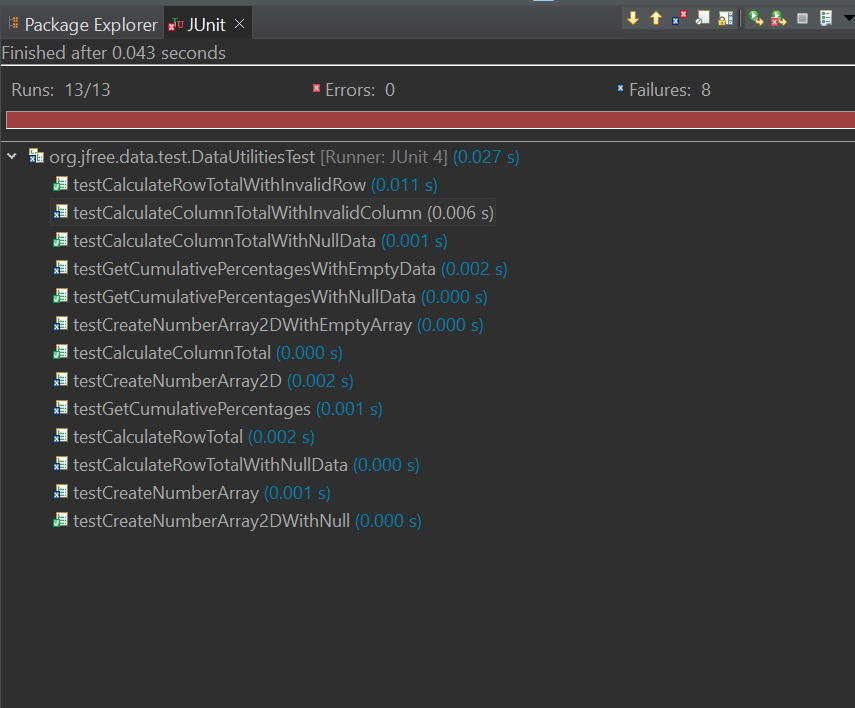
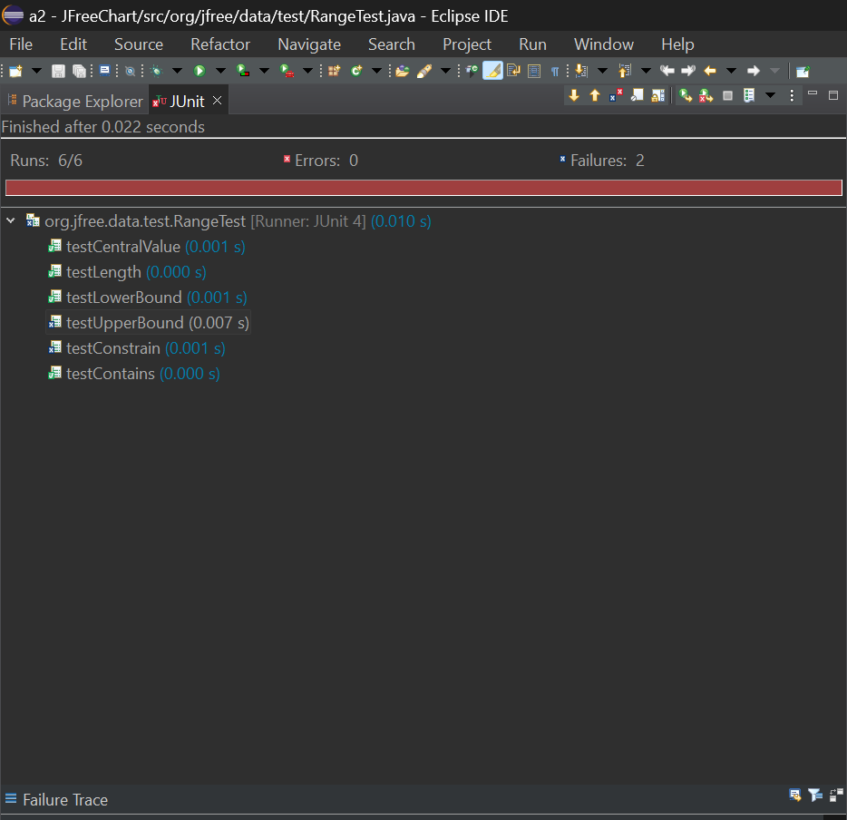

**SENG 637 - Software Testing, Reliability, and Quality**

**Lab. Report \#2 – Requirements-Based Test Generation**

| Group: 10       | 
|-----------------|
| Amey Brahme     |   
| Tejpreet Bal    |   
| Dhananjay Roy   |   
| Harshil Patel   |   
| Munal Akhtar    |   

# 1 Introduction
This exercise involved the implementation of JUnit testing for two Java classes within the Eclipse development environment. The initial steps included configuring the project and incorporating the necessary JFreeChart JAR files. Additionally, participants gained proficiency in navigating the Eclipse environment and became acquainted with setting up and executing JUnit tests.

Furthermore, the team actively engaged with Java Documentation, acquiring the skill to interpret and understand the functionality of the code. This process included delving into the documentation to discern the intentions behind each function as elucidated by the original developer. This comprehensive approach not only facilitated a thorough comprehension of the codebase but also provided insights into the rationale and design choices made by the initial developer.

# 2 Detailed description of unit test strategy

In the absence of detailed insights into the internal workings of the methods under consideration, the team opted for a black-box testing approach as part of their unit test strategy. The initial step involved a meticulous examination of the JavaDoc documentation for the DataUtilities and Range classes, focusing on the specifications outlined for each method. The team then selected five methods from the Range class for testing.

For each method in both classes, the adopted test strategy comprised a systematic approach. The team divided each parameter into two primary equivalence classes - valid and invalid, and further subdivided them into more specific classes. A critical facet of this strategy involved identifying boundary values within each class, applying boundary value analysis. Subsequently, redundant classes were eliminated to streamline the testing process.

To enhance the robustness of the test suite, the team conducted a comprehensive review of the test cases for each method. Any potential gaps in coverage were addressed by adding supplementary test cases, ensuring a thorough and exhaustive examination of the functionality without delving into the internal implementation details. The ensuing section provides a detailed presentation of the test cases developed through this rigorous and systematic testing strategy.

# 3 Test cases developed

## DataUtilities Test Cases

- **testCreateNumberArray**: Tests the `createNumberArray` method for converting a primitive double array into a Number array. This test case covers the nominal partition where the input is a valid non-empty array of doubles.
- **testCreateNumberArray2D**: Tests the `createNumberArray2D` method for converting a 2D double array into a 2D Number array. This test case covers the nominal partition for 2D arrays.
- **testCreateNumberArray2DWithNull**: Tests the `createNumberArray2D` method with a null input, expected to throw an IllegalArgumentException. This covers the error partition related to null input.
- **testCreateNumberArray2DWithEmptyArray**: Tests the `createNumberArray2D` method with an empty array, expected to throw an IllegalArgumentException. This covers the boundary condition for empty input arrays.
- **testCalculateColumnTotal**: Uses mocking to test `calculateColumnTotal` method by simulating a Values2D object. This covers the nominal partition for calculating column totals with valid data.
- **testCalculateColumnTotalWithNullData**: Tests `calculateColumnTotal` with null input, ensuring it handles null safely. This is part of the error partition handling.
- **testCalculateColumnTotalWithInvalidColumn**: Similar to `testCalculateColumnTotal` but for an invalid column index, ensuring it returns a total of 0.0. This covers boundary conditions for column indices.
- **testCalculateRowTotal**: Mocks a Values2D object to test `calculateRowTotal`, covering the nominal partition for row total calculations.
- **testCalculateRowTotalWithNullData**: Tests `calculateRowTotal` with null data, expected to handle null inputs appropriately.
- **testCalculateRowTotalWithInvalidRow**: Tests row total calculation with an invalid row index, ensuring it handles such cases gracefully.
- **testGetCumulativePercentages**: Tests the calculation of cumulative percentages from a KeyedValues dataset, covering the nominal partition.
- **testGetCumulativePercentagesWithNullData**: Tests cumulative percentage calculation with null input, expected to throw an IllegalArgumentException.
- **testGetCumulativePercentagesWithEmptyData**: Tests the method with empty data, also expected to throw an IllegalArgumentException.

## Range Test Cases

- **testCentralValue**: Tests calculation of the central value of a range, covering several partitions including positive, negative, and symmetric ranges.
- **testLength**: Tests the calculation of the length of a range, covering various types of ranges.
- **testLowerBound** and **testUpperBound**: Test the retrieval of lower and upper bounds of a range, covering various scenarios.
- **testConstrain**: Tests the constrain method, ensuring values outside the range are correctly constrained to the nearest boundary.
- **testContains**: Tests whether a range correctly identifies if it contains a specific value, covering both true and false scenarios.

## Benefits of Using Mocking:

- **Isolation**: Mocking allows for the testing of components in isolation, without the need for the actual dependencies to be present. This is particularly useful in unit testing where you want to test the functionality of a single component.
- **Control Over Behavior**: It provides control over the behavior of the mocked objects, allowing for the simulation of various scenarios that might be hard to replicate with actual objects (e.g., error conditions, exceptional cases).
- **Simplification**: Simplifies testing by removing the need to set up complex object graphs or databases, leading to faster and more focused tests.

## Drawbacks of Using Mocking:

- **Complexity**: Can introduce complexity into tests, making them harder to understand and maintain.
- **Overuse**: Overuse of mocks can lead to tests that are more about the interactions with the mocks rather than the actual functionality being tested, potentially missing integration issues.
- **Brittleness**: Tests can become brittle if the implementation changes but the functionality remains the same, leading to false negatives in testing outcomes.

# 4 How the team work/effort was divided and managed

At the project's outset, the team convened for a collaborative session to establish the Eclipse project setup, conduct a collective review of assigned tasks, and acquaint themselves with the process of interpreting Java documentation. Following a comprehensive understanding of the project requirements, individual team members were assigned responsibility for testing two specific methods each, resulting in the examination of a total of 10 methods.

Subsequently, the outcomes of the individual testing efforts underwent a thorough peer review. The collaborative nature of the team's approach is reflected in the joint creation of a comprehensive report for Section 3 of the overall documentation. Furthermore, the distribution of the remaining five sections of the report among the team members ensured a shared and equitable contribution to the documentation process, highlighting the collective effort invested in the successful execution and documentation of the testing procedures.

# 5 Difficulties encountered, challenges overcome, and lessons learned

Navigating the structure of JUnit tests posed an initial challenge, requiring adaptation to its intricacies. The division of work necessitated meticulous coordination to ensure the seamless integration of individual tests into a cohesive whole. Verification of each team member's test functionality, coupled with the task of maintaining a consistent tone across various sections of the report, added an additional layer of complexity.

To mitigate potential discrepancies, a comprehensive peer review process was implemented. This involved scrutinizing each other's code to validate the accurate incorporation of conditions. Subsequently, a designated team member undertook the responsibility of consolidating the diverse sections of the report, ensuring its coherence for readers. This collaborative and iterative approach not only addressed the challenges encountered but also contributed to the production of a unified and well-structured final deliverable.

# 6 Comments/feedback on the lab itself

The laboratory assignment proved to be a valuable exercise in honing our skills in testing through the application of black-box techniques and the utilization of JUnit. This practical experience significantly contributed to the establishment of a robust foundation for both unit testing and mocking practices. The assignment's effectiveness was notably enhanced by the clarity and comprehensiveness of the instructions provided in the assignment description markdown file. This meticulous guidance facilitated a smooth setup process and enabled prompt initiation of the assignment.

Throughout the completion of the assignment, the combination of class teachings and supplementary external resources played a pivotal role in addressing challenges and enhancing our understanding of the testing methodologies. The overall learning experience was commendable, fostering increased confidence among the team in the execution of JUnit testing. The structured nature of the lab, coupled with the supportive resources, collectively contributed to a positive and enriching learning environment.

